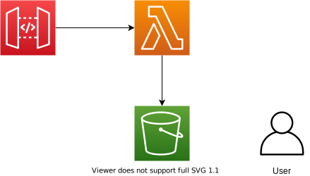

# API

A terraform module for create a serverless API that's exposed by [API Gateway](https://aws.amazon.com/api-gateway/) and implemented using [Lambda](https://aws.amazon.com/lambda/).

- API Gateway v2
  - Using the [Quick create](https://docs.aws.amazon.com/apigateway/latest/developerguide/api-gateway-basic-concept.html#apigateway-definition-quick-create) variant which "Quick create creates an API with a Lambda or HTTP integration, a default catch-all route, and a default stage that is configured to automatically deploy changes".
- AWS Lambda (serverless Compute)
  - S3 Bucket for storing the lambda (to decouple releases from provisioning)
- An IAM user for uploading code the to bucket

## Resources

- [Serverless Applications Lens - RESTful Microservices](https://docs.aws.amazon.com/wellarchitected/latest/serverless-applications-lens/restful-microservices.html)
